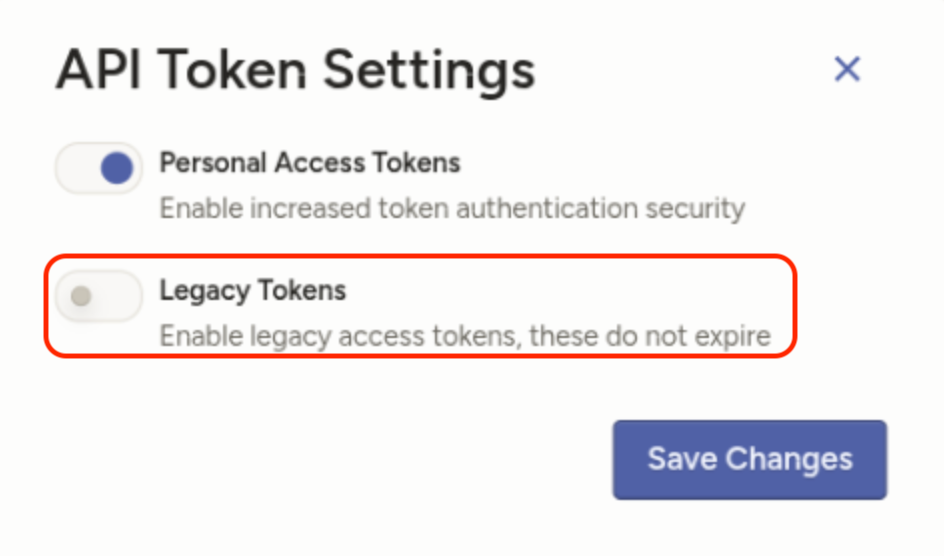
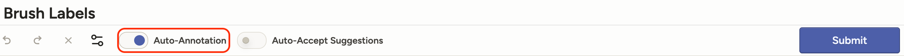
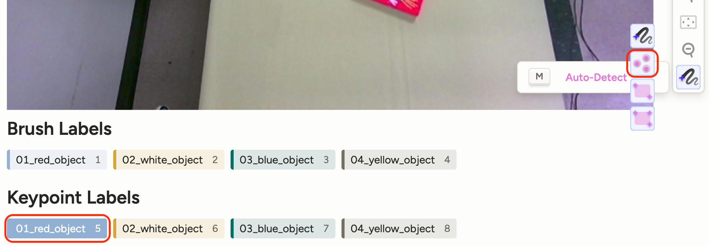
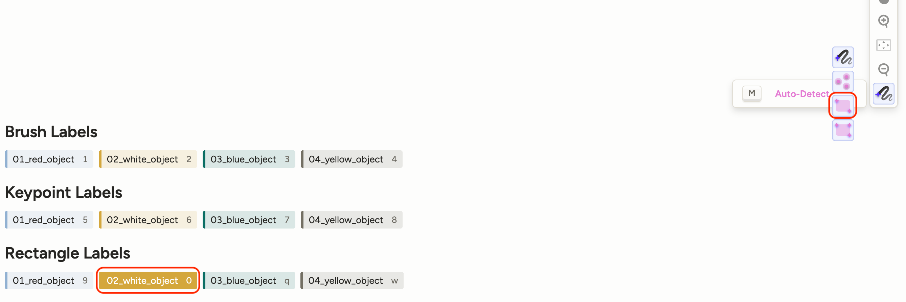

# Label Toolkit

[](https://www.python.org/downloads/release/python-310)
[](https://labelstud.io/)
[](./LICENSE)

---

## Overview

The Label Toolkit is built on top of [Label Studio](https://github.com/HumanSignal/label-studio) and the [Label Studio ML Backend](https://github.com/HumanSignal/label-studio-ml-backend), providing a web-based tool for efficient data labeling and annotation. Designed specifically to support SAM backend for annotating 2D image data, Label Toolkit offers a user-friendly interface for creating segmentation masks by prompting keypoints or bounding boxes, and assigning text labels to those masks.

---

## Table of Contents

- [Label Toolkit](#label-toolkit)
  - [Overview](#overview)
  - [Table of Contents](#table-of-contents)
  - [Environment Setup](#environment-setup)
  - [Launch and Stop the Label Toolkit](#launch-and-stop-the-label-toolkit)
  - [Example Usage](#example-usage)
- [License](#license)

---

## Environment Setup

1. **Clone the Repository**

   Clone the Label Toolkit repository and initialize submodules:

   ```bash
   git clone https://github.com/IRVLUTD/label-toolkit.git
   cd label-toolkit
   git submodule update --init --recursive
   ```

2. **Create Conda Environment**

   Set up a Python environment for Label Toolkit using Conda:

   ```bash
   conda create --name label-toolkit python=3.11 -y
   conda activate label-toolkit
   ```

<!-- 3. **Install Dependencies**

   Install required dependencies from requirements.txt:

   ```bash
   python -m pip install --no-cache-dir -r requirements.txt
   ``` -->

3. **Install label-toolkit**

   Install Label Toolkit in editable mode:

   ```bash
   python -m pip install -e .
   ```

4. **Build Docker Images**
   - Generate `.env` file for Docker:

   For Ubuntu:
   ```
   bash scripts/create_env.sh
   ```

   For Windows:
   ```
   powershell -ExecutionPolicy Bypass -File .\scripts\setup_env.ps1 -ConfigFile .\config\config.json
   ```

   - Build Docker images for Label Toolkit and SAM2 backend:

   ```bash
   docker compose -f docker-compose-sam2-image.yml build
   ```

---

## Launch and Stop the Label Toolkit

1. **Run the Label Toolkit with Docker**

   Use Docker Compose to start Label Toolkit:

   ```bash
   docker compose -f docker-compose-sam2-image.yml up -d
   ```

2. **Access the Label Toolkit**

   Open a browser and go to http://localhost:8080/user/login/ to access Label Toolkit.

   > [!CAUTION]
   > For the first time use, you need to enable the **Legacy Access Token**. ([#7355](https://github.com/HumanSignal/label-studio/issues/7355))
   > Please log in to Label Toolkit with the default admin account
   > (**admin@gmail.com / admin**), then navigate to
   > **Organisation → API Token Settings** and enable **Legacy Tokens**.
   > 

3. **Stop the Label Toolkit**

   To stop the service, run:

   ```bash
   docker compose -f docker-compose-sam2-image.yml down
   ```

---

## Example Usage

1. **Add users to the Label Toolkit**

   By default, an admin user (admin@gmail.com) is available. To add more users, use the following script.

   For Ubuntu:
   ```bash
   bash scripts/add_user.sh <username> <(optional)password>

   # Example:
   bash scripts/add_user.sh user1 label-studio
   ```

   For Windows:
   ```
   .\scripts\add_user.ps1 <username> <(optional)password>

   # Example:
   .\scripts\add_user.ps1 user1 label-studio
   ```   

   This script will create a new user with the specified email format `<username>@gmail.com`. If a password is not provided, the default password will be set to `label-studio`.

2. **Add a New Project from Scene Folder**
   - Add a project by specifying a folder containing scene images:

   For Ubuntu:
   ```bash
   bash scripts/add_project.sh <path/to/scene/folder>
   ```

   For Windows:
   ```
   .\scripts\add_project.ps1 <path/to/scene/folder>
   ```   

   This script adjusts folder permissions, creates a project named after the scene folder, adds all `*.jpg` images to the project, and configures SAM backend integration.
   - A `meta.json` file is required in the scene folder to specify the available labels for annotation. The `meta.json` file should be in the following format:

   ```json
   {
     "object_labels": ["01_object_1", "02_object_2", "03_object_3"]
   }
   ```

3. **Demo to Create Annotation**
   - Auto-annotation Settings:
     To enable auto-annotation, enable the "auto-annotation" button in the bottom left of the Label Toolkit interface. And then, make sure to pick the correct auto-annotation model (e.g., point, rectangle) in the settings panel on the right.
     - Enable Auto-annotation:
       
     - Keypoint annotation mode:
       
     - Bounding box annotation mode:
       

   - Below is a demonstration of creating annotations using SAM backend integration:

   

# License

This project is licensed under the [MIT License](./LICENSE). However, it includes Label Studio ML Backend as a submodule, which is licensed under the [Apache License 2.0](./third-party/label-studio-ml-backend/LICENSE). Please ensure that you comply with the terms of the Apache License 2.0 for any use or distribution of Label Studio ML Backend within this toolkit.
